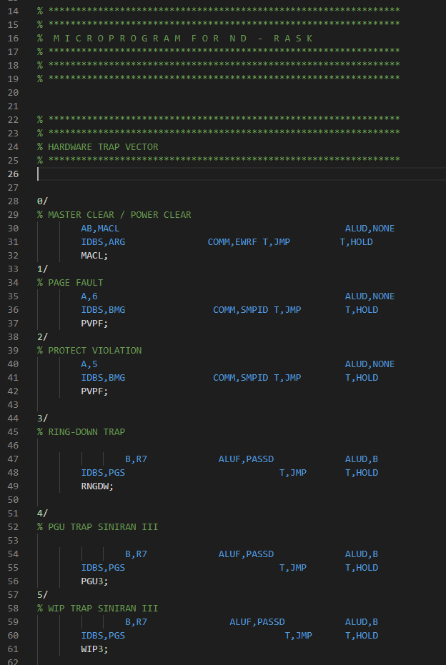

# nd-110-microcode README

Adds syntax highlighting for the ND-110 microcode language.

This extension was orignally written to help clean up the OCR export of the microcode from the PDF.

The filename extstension chosen is `.uc`

## Install

First install [Visual Studio Code](https://code.visualstudio.com). In the command palette (`cmd-shift-p`) select `Install Extension` and choose `ND-110`.  

## Sample file

Check out the file `sample.uc`

## Screenshot

## License
[MIT](LICENSE)

